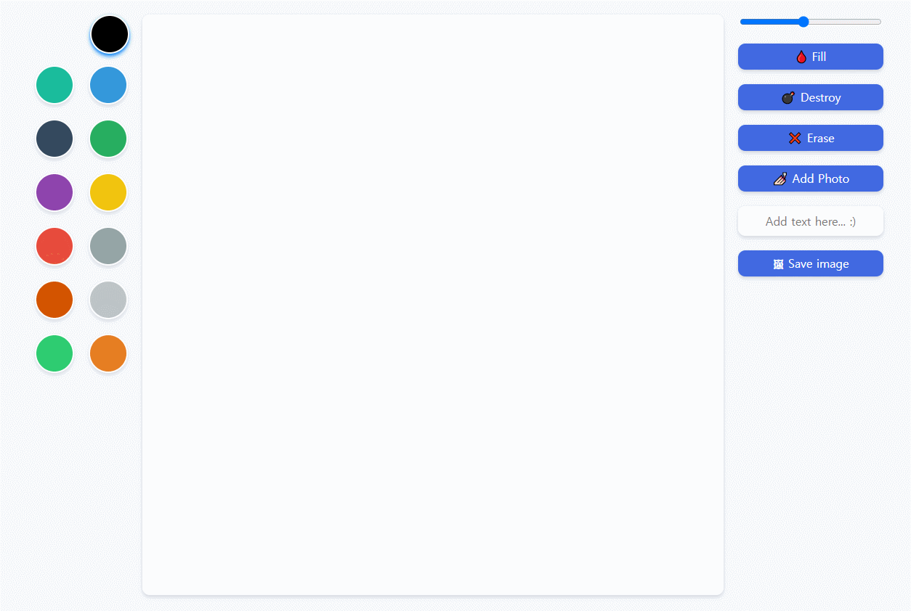
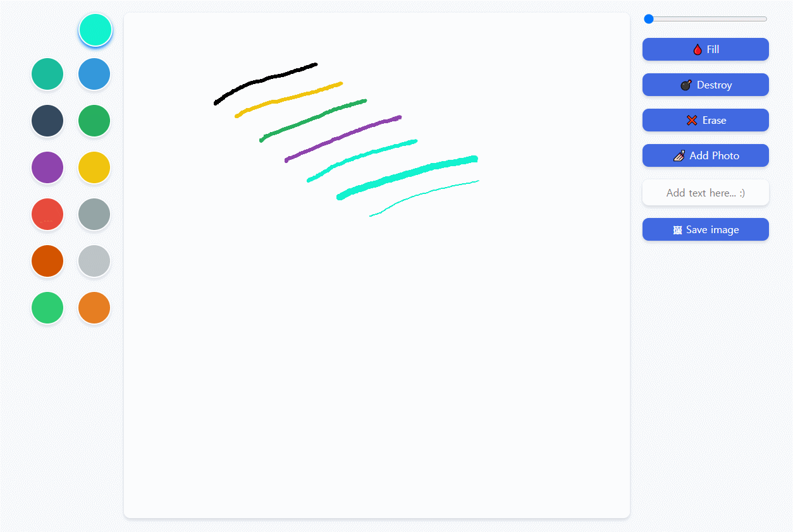
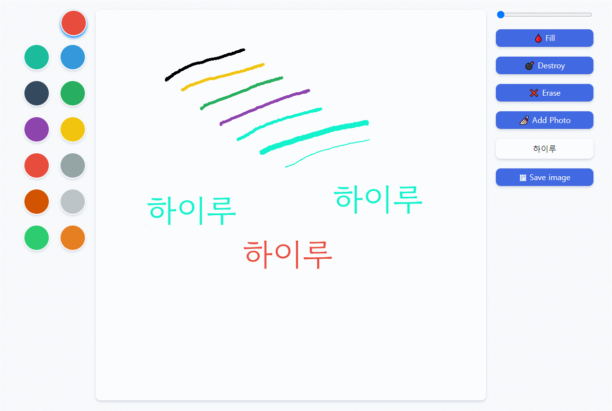
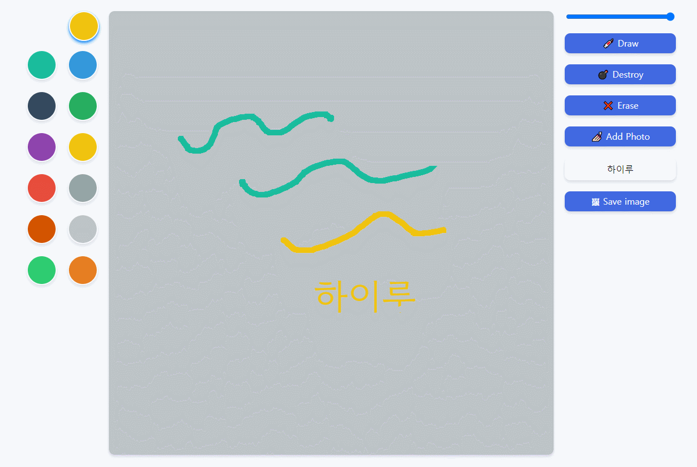
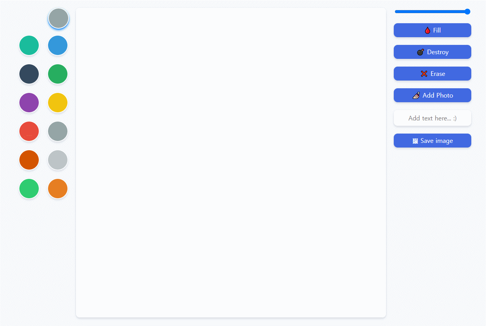
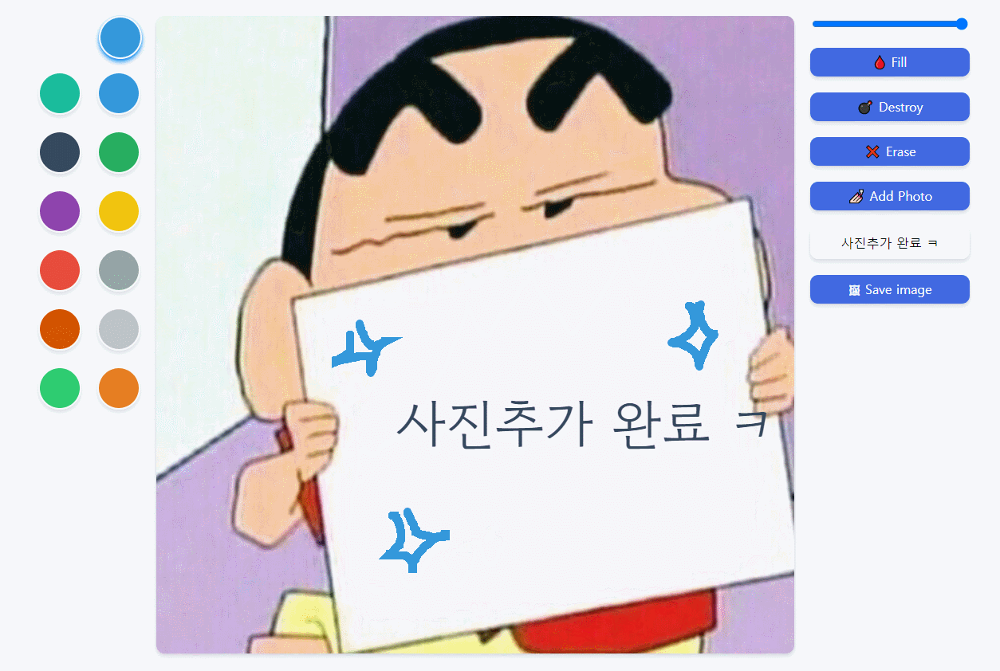

# 🎨 MEME_MAKER

노마드코더의 [[바닐라JS로 그림앱 만들기](https://nomadcoders.co/javascript-for-beginners-2)] 강의를 수강하면서 밈메이커의 기본 기능을 구현해보고 

개발 환경 설정과 SCSS 적용, 그리고 기능 개선을 추가해 나만의 "짤 생성기"를 제작했습니다.

> https://sryung1225.github.io/MEME_MAKER/

(권장 사용 환경 : Window10, Chrome)

  

---

## 😎 짤 생성기

### 1️⃣ 선 그리기

 

캔버스 안에서 원하는 대로 그림을 그릴 수 있습니다.  

좌측 색상판을 통해 선 색을 선택할 수 있습니다.  
가장 상단에 있는 원이 현재 선택된 색상을 보여주며, 클릭 시 이미 만들어져있는 색상판의 색상 뿐만 아니라 원하는 색을 직접 고를 수 있습니다.  

우측 상단 게이지를 통해서 선의 굵기를 지정할 수 있습니다.  

### 2️⃣ 텍스트 입력하기

 

캔버스 안에 텍스트를 추가할 수 있습니다.  
우측에 있는 입력창을 통해 텍스트를 입력한 뒤, 색상을 적용해 추가할 수 있습니다.  

### 3️⃣ 배경색 채우기

 

우측에 있는 Fill 버튼을 클릭하면 Fill 모드로 변경됩니다.  
Fill 모드에서는 캔버스를 원하는 배경색으로 채울 수 있습니다.  
다시 선을 그리고 싶다면 Draw 버튼을 클릭해 모드를 변경할 수 있습니다.  

### 4️⃣ 지우기와 초기화

 

우측에 있는 Erase 버튼을 클릭하면, 선을 그리던 방법과 같이 드래그를 이용해서 그려진 선을 지울 수 있습니다.  
그리고 Destroy 버튼은 초기화를 의미합니다.  
Destroy 버튼을 누르면 처음 상태와 같은 하얀 배경의 캔버스로 되돌아갑니다. 

### 5️⃣ 사진 추가하기

 

우측에 있는 Add Photo 버튼을 통해 이미지를 불러올 수 있습니다.  
선택된 이미지는 캔버스의 배경으로 적용됩니다.  
전과 같이 사진 위에 선을 그리거나 텍스트를 입력할 수 있습니다.  

### 6️⃣ 사진 저장하기

 

우측 가장 아래에 있는 Save Image 버튼을 클릭하면  
지금까지 만든 이미지를 컴퓨터에 저장할 수 있습니다.  
이미지 파일은 myDrawing 이라는 이름에 PNG 포맷으로 기본 지정됩니다.  
